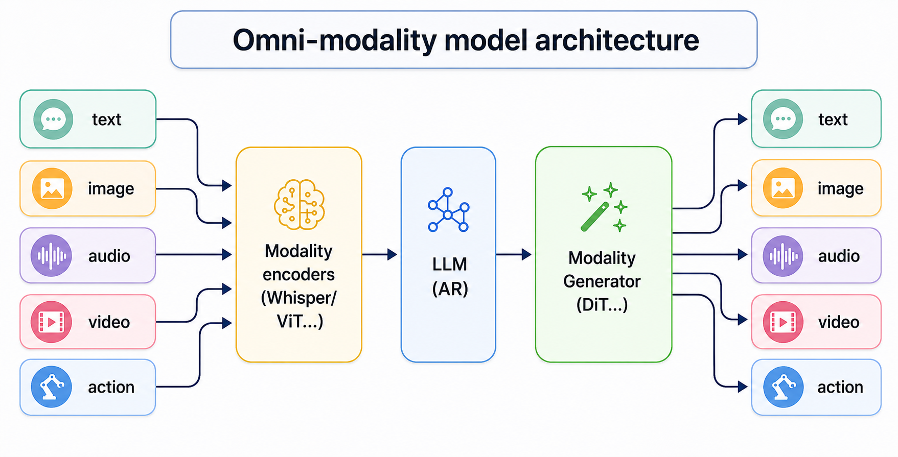

---
hide:
  - navigation
  - toc
---

# Welcome to vLLM-Omni

  <picture>
    <source media="(prefers-color-scheme: dark)" src="./source/logos/vllm-omni-logo.png">
    
  </picture>

<h3 align="center">
Easy, fast, and cheap omni-modality model serving for everyone
</h3>

<a class="github-button" href="https://github.com/vllm-project/vllm-omni" data-show-count="true" data-size="large" aria-label="Star">Star</a>
<a class="github-button" href="https://github.com/vllm-project/vllm-omni/subscription" data-show-count="true" data-icon="octicon-eye" data-size="large" aria-label="Watch">Watch</a>
<a class="github-button" href="https://github.com/vllm-project/vllm-omni/fork" data-show-count="true" data-icon="octicon-repo-forked" data-size="large" aria-label="Fork">Fork</a>

## About

[vLLM](https://github.com/vllm-project/vllm) was originally designed to support large language models for text-based autoregressive generation tasks. vLLM-Omni is a framework that extends its support for omni-modality model inference and serving:

- **Omni-modality**: Text, image, audio, video, and action data processing
- **Non-autoregressive Architectures**: extend the AR support of vLLM to Diffusion Transformers (DiT) and other parallel generation models
- **Heterogeneous outputs**: from traditional text generation to multimodal and action outputs

  <picture>
    <source media="(prefers-color-scheme: dark)" src="./source/architecture/omni-modality-model-architecture.png">
    
  </picture>

vLLM-Omni is fast with:

- State-of-the-art AR support by leveraging efficient KV cache management from vLLM
- Pipelined stage execution overlapping for high throughput performance
- Fully disaggregation based on OmniConnector and dynamic resource allocation across stages

vLLM-Omni is flexible and easy to use with:

- Heterogeneous pipeline abstraction to manage complex model workflows
- Seamless integration with popular Hugging Face models
- Tensor, pipeline, data and expert parallelism support for distributed inference
- Streaming outputs
- OpenAI-compatible API server

vLLM-Omni seamlessly supports most popular open-source models on HuggingFace, including:

- Omni-modality models (e.g. Qwen3-Omni, Cosmos3, HunyuanImage, BAGEL)
- TTS models (e.g. Qwen3-TTS, VoxCPM2, Ming-Omni-TTS, CosyVoice3)
- Diffusion models — image, video, and audio generation (e.g. Qwen-Image, Wan2.2, FLUX)
- Robot-policy and action models (e.g. GR00T-N1.7, DreamZero-DROID, InternVLA-A1, Cosmos3 action policy)

For more information, checkout the following:

- [vllm-omni architecture design and recent roadmaps](https://docs.google.com/presentation/d/1XJWgv79lORl8rbaVvp2d5Sqs6ZEBgAgj/edit?slide=id.p1#slide=id.p1)
- [vllm-omni announcement blogpost](https://blog.vllm.ai/2025/11/30/vllm-omni.html)
