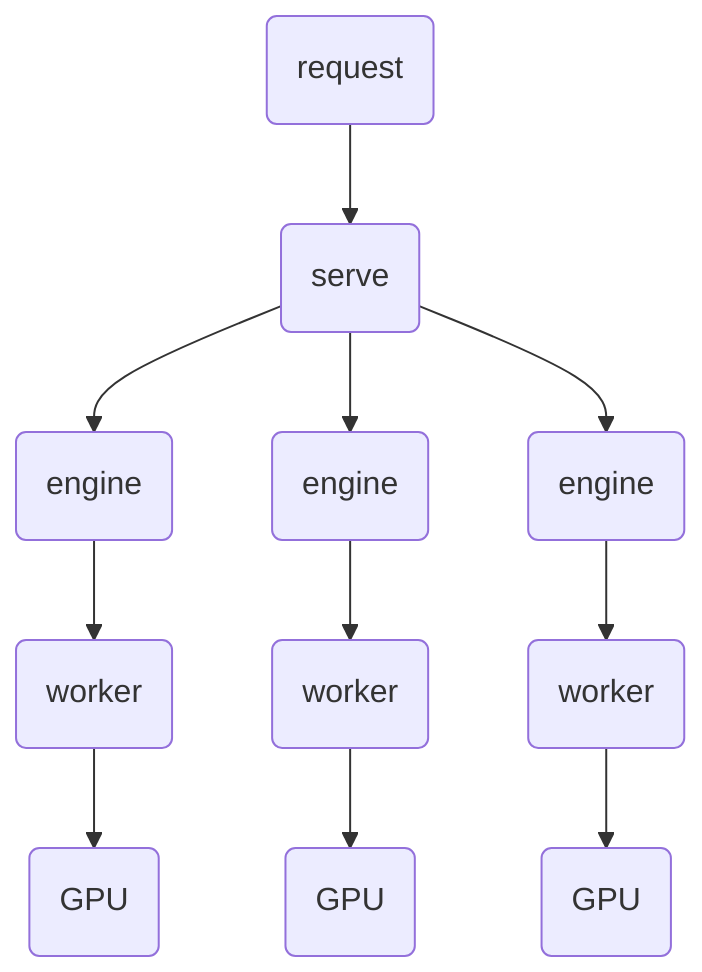

# vLLM-Omni Failure Mode Injection Scenarios and Expected Behavior Matrix

## Background and Goals

The online serving pipeline of vLLM-Omni can be abstracted as: `Serve` (service entry process) -> `Engine` (model orchestration unit) -> `Worker` (execution process) -> `GPU` (compute resource).

- `Serve` provides external APIs, accepts requests, and manages lifecycle.
- `Engine` handles request scheduling and inference orchestration; the number and organization of engines can vary by model type.
- `Worker` performs concrete model computation, usually bound to underlying GPU resources.
- `GPU` is the resource layer that ultimately carries inference compute and memory usage.

<div markdown style="text-align: center">



</div>

The diagram above shows an abstract relationship. Omni models and Diffusion models share the same hierarchy; differences mainly come from engine decomposition, worker count, and scheduling strategy.

In real customer environments, the system will inevitably encounter accidental operations or environmental disturbances, such as unintended process termination, container/node jitter, or short-term resource contention. From the system perspective, many of these events map to two fault categories: "process receives abnormal signals" or "GPU memory is squeezed." For example, pressing `Ctrl+C` essentially sends a `SIGINT` signal to the `serve` process; running `kill -15 <pid>` maps to graceful termination via `SIGTERM`; running `kill -9 <pid>` maps to forced termination via `SIGKILL`; when `docker kill` is executed or a Pod is deleted, the container runtime usually sends `SIGKILL`.

This document currently covers two core failure modes, and the system is expected to show predictable and observable behavior under each mode:

- **Failure Mode 1: Process receives abnormal signals (`SIGINT` / `SIGTERM` / `SIGKILL`)**  
  Focus on three aspects: whether processes exit as expected and complete cleanup, whether requests fail fast or connections are interrupted, and whether GPU resources are eventually fully released with no residue.
- **Failure Mode 2: OOM (occupy all free GPU memory via an extra process)**  
  Focus on two aspects: whether service health degrades to the expected state (for example, `503`), and whether requests fail within an acceptable time without hanging.

More failure modes (for example, network jitter and network interruption) will be added in future iterations to improve end-to-end reliability validation coverage.

> Note: independent fault injection on the `engine` component is not covered in the current version and will be added gradually in future versions.

## Fault Injection Scenario Matrix

| Scenario | Fault Type | System Behavior | Current Status |
|------|----------------------------|----------|----------|
| No load | Send `SIGKILL` to Worker | Worker process is killed immediately; main service detects child-process loss and turns unavailable; API enters stable 5xx |  |
| No load | Send `SIGTERM` to Worker | Worker exits after receiving termination signal; main service is marked unavailable; API enters stable 5xx |  |
| No load | Send `SIGKILL` to serve main process | serve main process exits instantly; request connections are interrupted; related child processes are cleaned up with no residue; GPU memory is released quickly | [#3725](https://github.com/vllm-project/vllm-omni/issues/3725) <br>[#43060](https://github.com/vllm-project/vllm/issues/43060) |
| No load | Send `SIGTERM` to serve main process | serve enters graceful shutdown and stops serving; then exits and completes cleanup; GPU memory is released |  |
| No load | Send `SIGINT` to serve main process (equivalent to `Ctrl+C`) | Triggers serve shutdown path; service stops responding and becomes unavailable; related child processes exit and resources are released |  |
| No load | Send `SIGKILL` to all related processes | All related processes terminate immediately; service becomes unavailable at once; no residual processes remain; GPU memory is released quickly |  |
| No load | Send `SIGTERM` to all related processes | All processes enter exit flow and complete shutdown; service becomes unavailable; resource release is completed |  |
| Under load | Send `SIGKILL` to Worker | In-flight requests are hard interrupted (5xx/connection drop); main service becomes unavailable | [#3683](https://github.com/vllm-project/vllm-omni/issues/3683) |
| Under load | Send `SIGTERM` to Worker | In-flight requests are canceled or fail fast; main service becomes unavailable |  |
| Under load | Send `SIGKILL` to serve main process | serve is hard-killed and current connections are interrupted; in-flight requests fail; after cleanup there are no residual processes and GPU memory is released | [#3683](https://github.com/vllm-project/vllm-omni/issues/3683) |
| Under load | Send `SIGTERM` to serve main process | serve stops accepting new requests and executes shutdown flow; in-flight requests fail; no residue remains and GPU memory is released | [#3683](https://github.com/vllm-project/vllm-omni/issues/3683) |
| Under load | Send `SIGINT` to serve main process (equivalent to `Ctrl+C`) | `Ctrl+C`-style serve shutdown; in-flight requests fail (5xx/connection interruption); service unavailable; after exit there is no residue and GPU memory is released | [#3683](https://github.com/vllm-project/vllm-omni/issues/3683) |
| Under load | Send `SIGKILL` to all related processes | All processes terminate instantly; all in-flight requests fail; service becomes unavailable immediately; GPU memory is released quickly |  |
| Under load | Send `SIGTERM` to all related processes | All processes exit gracefully; in-flight requests fail; service unavailable; GPU memory is released | [#3683](https://github.com/vllm-project/vllm-omni/issues/3683) |
| OOM | Occupy all free GPU memory via an extra process | After OOM injection process starts, GPU memory is continuously saturated; service enters unavailable/degraded state and health check drops to 503; different request types (chat/speech, etc.) fail fast within a fixed time and return 500 (no hanging) | [#4285](https://github.com/vllm-project/vllm-omni/issues/4285) |

## Source of Conclusions

The behaviors and conclusions above are summarized from current fault injection validation results on **`Qwen3-Omni`**, **`Wan2.2`**, **`HunyuanImage-3.0-Instruct`** (DiT-only, `/v1/images/generations`), and **`VoxCPM2`** (`/v1/audio/speech`). Automated coverage lives under `tests/dfx/reliability/` (`test_reliability_qwen3_omni.py`, `test_reliability_wan22.py`, `test_reliability_hunyuan_image.py`, `test_reliability_voxcpm2.py`) and runs weekly via `.buildkite/cuda/test-weekly.yml`.

### Example: `SIGTERM` fault injection log (Qwen3-Omni)

The following full log is from a real run where a `SIGTERM` signal was sent to the serve root process.

```text
Launching OmniServer with: /workspace/.venv/bin/python3 -m vllm_omni.entrypoints.cli.main serve Qwen/Qwen3-Omni-30B-A3B-Instruct --host 127.0.0.1 --port 60675 --omni --async-chunk --stage-init-timeout 600 --init-timeout 900 --log-stats --stage-configs-path vllm-omni/vllm_omni/deploy/qwen3_omni_moe.yaml
Server ready on 127.0.0.1:60675 (OmniServer startup took 206.023s)
OmniServer started successfully
[reliability][process-kill] current_server_proc pid=556855 name=python3 cmdline=/workspace/.venv/bin/python3 -m vllm_omni.entrypoints.cli.main serve Qwen/Qwen3-Omni-30B-A3B-Instruct --host 127.0.0.1 --port 60675 --omni --async-chunk --stage-init-timeout 600 --init-timeout 900 --log-stats --stage-configs-path vllm-omni/vllm_omni/deploy/qwen3_omni_moe.yaml
[reliability][process-kill] current_server_proc pid=557118 name=python3 cmdline=/workspace/.venv/bin/python3 -c from multiprocessing.resource_tracker import main;main(57)
[reliability][process-kill] current_server_proc pid=557119 name=VLLM::StageEngineCoreProc_noid_replica0_DP0 cmdline=VLLM::StageEngineCoreProc_noid_replica0_DP0
[reliability][process-kill] current_server_proc pid=557122 name=VLLM::StageEngineCoreProc_noid_replica0_DP0 cmdline=VLLM::StageEngineCoreProc_noid_replica0_DP0
[reliability][process-kill] current_server_proc pid=558201 name=VLLM::StageEngineCoreProc_noid_replica0_DP0 cmdline=VLLM::StageEngineCoreProc_noid_replica0_DP0

[reliability][process-kill] root-kill pid=556855 name=python3 signal=SIGTERM cmdline=/workspace/.venv/bin/python3 -m vllm_omni.entrypoints.cli.main serve Qwen/Qwen3-Omni-30B-A3B-Instruct --host 127.0.0.1 --port 60675 --omni --async-chunk --stage-init-timeout 600 --init-timeout 900 --log-stats --stage-configs-path vllm-omni/vllm_omni/deploy/qwen3_omni_moe.yaml
[0;36m(APIServer pid=556855)[0;0m INFO 05-19 12:24:51 [omni_base.py:463] [AsyncOmni] Shutting down
[0;36m(APIServer pid=556855)[0;0m INFO 05-19 12:24:51 [async_omni_engine.py:2397] [AsyncOmniEngine] Shutting down Orchestrator
[0;36m(APIServer pid=556855)[0;0m INFO 05-19 12:24:51 [orchestrator.py:351] [Orchestrator] Received shutdown signal
[0;36m(APIServer pid=556855)[0;0m INFO 05-19 12:24:51 [orchestrator.py:1359] [Orchestrator] Shutting down all 3 client(s)

[0;36m(StageEngineCoreProc pid=557119)[0;0m [32mINFO[0m [90m05-19 12:24:51[0m [90m[core.py:1242][0m Shutdown initiated (timeout=0)
[0;36m(StageEngineCoreProc pid=557119)[0;0m [32mINFO[0m [90m05-19 12:24:51[0m [90m[core.py:1265][0m Shutdown complete
[0;36m(APIServer pid=556855)[0;0m INFO:     Shutting down
[0;36m(APIServer pid=556855)[0;0m INFO:     Waiting for application shutdown.
[0;36m(APIServer pid=556855)[0;0m INFO:     Application shutdown complete.
[0;36m(APIServer pid=556855)[0;0m INFO:     Finished server process [556855]
[0;36m(APIServer pid=556855)[0;0m INFO 05-19 12:24:51 [omni_base.py:463] [AsyncOmni] Shutting down
[rank0]:[W519 12:24:53.427894833 ProcessGroupNCCL.cpp:1575] Warning: WARNING: destroy_process_group() was not called before program exit, which can leak resources. For more info, please see https://pytorch.org/docs/stable/distributed.html#shutdown (function operator())
[0;36m(APIServer pid=556855)[0;0m INFO 05-19 12:24:56 [stage_pool.py:731] [StagePool] Stage 0 replica 0 shut down
[0;36m(StageEngineCoreProc pid=557122)[0;0m [32mINFO[0m [90m05-19 12:24:56[0m [90m[core.py:1242][0m Shutdown initiated (timeout=0)
[0;36m(StageEngineCoreProc pid=557122)[0;0m [32mINFO[0m [90m05-19 12:24:56[0m [90m[core.py:1265][0m Shutdown complete
[rank0]:[W519 12:24:57.569425065 ProcessGroupNCCL.cpp:1575] Warning: WARNING: destroy_process_group() was not called before program exit, which can leak resources. For more info, please see https://pytorch.org/docs/stable/distributed.html#shutdown (function operator())
[0;36m(APIServer pid=556855)[0;0m INFO 05-19 12:25:00 [stage_pool.py:731] [StagePool] Stage 1 replica 0 shut down
[0;36m(StageEngineCoreProc pid=558201)[0;0m [32mINFO[0m [90m05-19 12:25:00[0m [90m[core.py:1242][0m Shutdown initiated (timeout=0)
[0;36m(StageEngineCoreProc pid=558201)[0;0m [32mINFO[0m [90m05-19 12:25:00[0m [90m[core.py:1265][0m Shutdown complete
[0;36m(APIServer pid=556855)[0;0m WARNING 05-19 12:25:01 [async_omni_engine.py:2406] [AsyncOmniEngine] Orchestrator thread did not exit in time
[rank0]:[W519 12:25:01.867242016 ProcessGroupNCCL.cpp:1575] Warning: WARNING: destroy_process_group() was not called before program exit, which can leak resources. For more info, please see https://pytorch.org/docs/stable/distributed.html#shutdown (function operator())
```

### How this maps to the matrix

- This log corresponds to the `Send SIGTERM to serve main process` scenario in the matrix.
- The `root-kill ... signal=SIGTERM` line confirms the fault injection action is applied as expected.
- The sequence from `Shutting down Orchestrator` to stage-level `Shutdown complete` and `Stage ... shut down` matches the expected graceful shutdown path and child-process cleanup behavior described in the matrix.

## Related Documentation

- For practical CI debugging procedures and triage guidance, see [CI Failures](../contributing/ci/failures.md).
